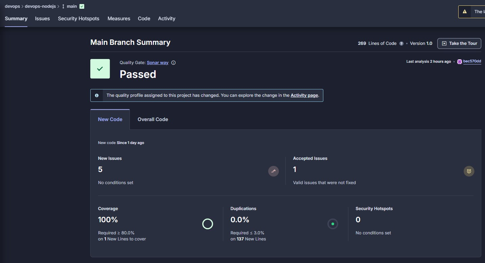
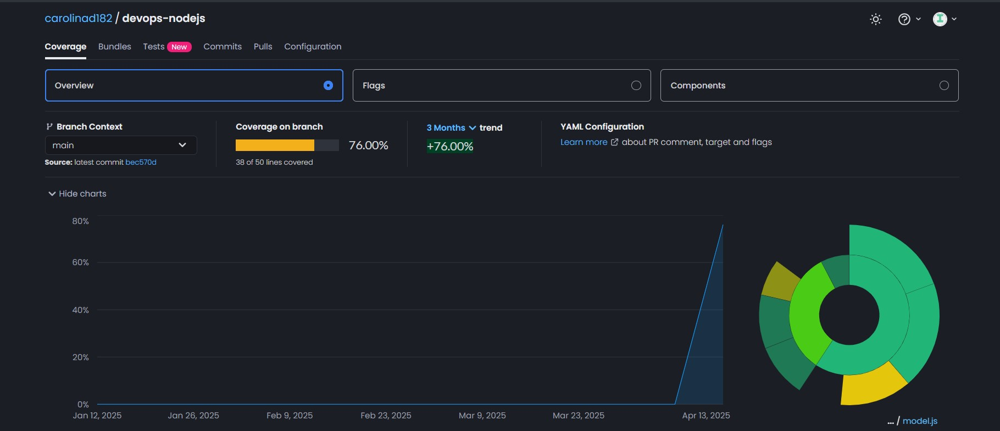
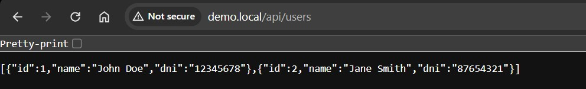
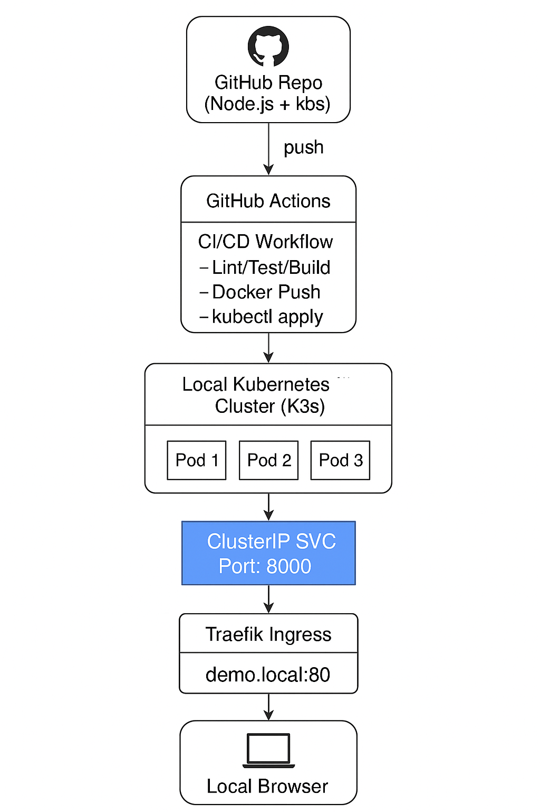

# 📦 devops-nodejs

Este proyecto es una API construida con Node.js que utiliza Docker para la contenerización, GitHub Actions para la integración y entrega continuas (CI/CD), y Kubernetes (K3s) para el despliegue local. Incluye pruebas automatizadas, análisis de código, cobertura de pruebas y autoescalado de pods.


## 🚀 CI/CD con GitHub Actions

El flujo de trabajo de GitHub Actions (`.github/workflows/ci-cd.yml`) automatiza los siguientes pasos:

- ✅ Test
- 🧠 Análisis de Código
- 📊 Cobertura de Pruebas
- 🔧 Build
- 🐳 Push de Imagen a Docker Hub
- ☸️ Despliegue automático en Kubernetes (`kubectl apply`)

### 🔐 Secretos necesarios en GitHub

Agrega los siguientes secretos en tu repositorio (Settings > Secrets > Actions):

- `DOCKER_USERNAME`: Tu nombre de usuario de DockerHub.
- `DOCKER_PASSWORD`: Tu token o contraseña de DockerHub.
- `CODECOV_TOKEN`: Token generado por Codecov para subir reportes de cobertura de código. Puedes obtenerlo desde tu proyecto en Codecov.
- `SONAR_HOST_URL`: URL de tu instancia de SonarQube.
- `SONAR_TOKEN`: Token de autenticación de tu cuenta de SonarQube, utilizado para enviar los análisis de código al escáner Sonar.

---

## 🧠 Análisis de Código

Se utiliza SonarQube para analizar el código, asegurandose que cumpla con el estándar "Sonar Way". Si no cumple con este estándar, el test falla y no procede a la construccion de imagen hasta que se solucione o se apruebe como seguro el problema. Ejemplo de como se ve en la web:



## 📊 Cobertura de Pruebas

Se utiliza CodeCov para analizar la cobertura de pruebas.  Ejemplo de como se ve en la web:



---
## 🐳 Docker Manual

### 🏗️ Build de la imagen

```bash
docker build -t DOCKERHUB_USERNAME/devops-nodejs:latest .
```

### 📤 Push a Docker Hub

```bash
docker push DOCKERHUB_USERNAME/devops-nodejs:latest
```

---

## ☸️ Despliegue en Kubernetes

Aplica los manifiestos:

```bash
kubectl apply -f k8s/secrets.yaml
kubectl apply -f k8s/deployment.yaml
kubectl apply -f k8s/service.yaml
kubectl apply -f k8s/ingress.yaml
kubectl apply -f k8s/hpa.yaml
```
Para confirmar que todo ha sido desplegado correctamente, correr el comando `kubectl get all -n devops-app`, la salida deberia ser similar a esta:

```bash
kubectl get all -n devops-app
NAME                                  READY   STATUS    RESTARTS   AGE
pod/demo-devops-app-f5644b594-bl478   1/1     Running   0          4h12m
pod/demo-devops-app-f5644b594-z2s5g   1/1     Running   0          4h12m

NAME                          TYPE        CLUSTER-IP     EXTERNAL-IP   PORT(S)    AGE
service/demo-devops-service   ClusterIP   10.43.137.26   <none>        8000/TCP   4h12m

NAME                              READY   UP-TO-DATE   AVAILABLE   AGE
deployment.apps/demo-devops-app   2/2     2            2           4h12m

NAME                                        DESIRED   CURRENT   READY   AGE
replicaset.apps/demo-devops-app-f5644b594   2         2         2       4h12m

NAME                                                  REFERENCE                    TARGETS       MINPODS   MAXPODS   REPLICAS   AGE
horizontalpodautoscaler.autoscaling/demo-devops-hpa   Deployment/demo-devops-app   cpu: 0%/50%   2         3         2          4h12m
```
---

## 🔐 Secretos (Base64)

Los secretos se definen en `k8s/secrets.yaml`. Codifica cada valor en base64:

```bash
echo -n 'valor' | base64
```

Ejemplo:

```yaml
apiVersion: v1
kind: Secret
metadata:
  name: db-secrets
type: Opaque
data:
  DATABASE_NAME: ZGV2LnNxbGl0ZQ==       
  DATABASE_USER: dXNlcg==             
  DATABASE_PASSWORD: cGFzc3dvcmQ=       
```

---

## 🌐 Acceso a la API

Una vez desplegado, consulta la dirección IP asignada usando el comando `kubectl get ingress -n devops-app` 
```bash
kubectl get ingress -n devops-app
NAME                  CLASS     HOSTS        ADDRESS        PORTS   AGE
demo-devops-ingress   traefik   demo.local   172.29.2.228   80      4h7m
```
Asegúrate de tener esta entrada en `/etc/hosts`, usando la dirección IP obtenida en el comando anterior:

```
172.29.2.228 demo.local
```
Una vez agregada, accede a la API desde tu navegador en:

```
http://demo.local
```
Ejemplo de como se vería en el navegador


---

## 🧪 Test Bash Script

Puedes probar la API con el script Bash incluido:

```bash
chmod +x test-api.sh
./test-api.sh
```

Este script hace llamadas a los endpoints de la API expuesta en `demo.local`.

Ejemplo 
```bash
bash test-api.sh
Testing API endpoints...

Test 1: Creating a user
Response: {"error":"User already exists: 12345678"}

Test 2: Getting all users
[
  {
    "id": 1,
    "name": "John Doe",
    "dni": "12345678"
  }
]

Test 3: Getting user with ID
[
  {
    "id": 1,
    "name": "John Doe",
    "dni": "12345678"
  }
]

Test 4: Creating another user
{"id":2,"dni":"87654321","name":"Jane Smith"}

Test 5: Getting non-existent user (should return 404)
Expected: 404 Not Found
{
  "error": "User not found: 999999"
}

All tests completed!
```
---


## 🖼️ Diagrama de Arquitectura



---

## 📚 Recursos

- [GitHub Actions Docs](https://docs.github.com/es/actions)
- [Kubernetes Docs](https://kubernetes.io/es/docs/home/)
- [Docker Docs](https://docs.docker.com/)
- [K3s Docs](https://docs.k3s.io/)


